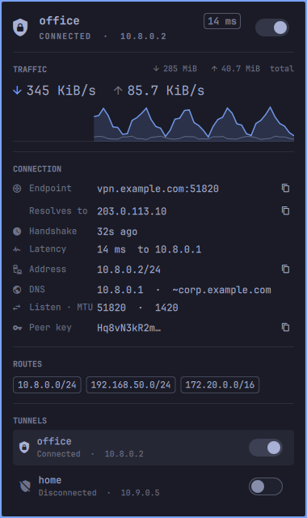

# WireGuard for Omarchy

An [Omarchy](https://omarchy.org) shell (Quickshell) bar widget for
**WireGuard** tunnels managed by `wg-quick`.

See whether the tunnel is really passing traffic at a glance, and open a panel
for live throughput, handshake age, latency, routes and DNS, with a switch to
connect or disconnect.



- **Bar icon** — a shield: normal when connected, in the urgent colour when a
  tunnel is up but the peer has stopped handshaking, dimmed when nothing is
  up. Hovering shows each tunnel's state, address and live rates.
- **Panel**
  - tunnel name, state, address and round-trip latency, with an on/off switch
  - live download/upload rates, a two-minute traffic graph and totals
  - endpoint (hostname *and* the IP it resolved to), last handshake, latency,
    tunnel address, DNS servers and routing domains, listen port and MTU, and
    the peer's key
  - the routes (AllowedIPs) the tunnel carries
  - a list of every tunnel, each with its own switch, when you have more than one
  - reconnect, refresh and copy buttons
- **Notifications** when a tunnel drops, stops handshaking or recovers on its
  own. Changes you make from the widget report in the panel instead.
- A tunnel that is down shows its configuration (endpoint, address, routes,
  DNS), so you can see what connecting would do.

"Up" isn't the same as working. An interface can exist while the peer is
unreachable, so the widget treats a tunnel as connected only when its latest
handshake is under three minutes old. With `PersistentKeepalive` set, a live
peer handshakes at least every two minutes.

## Requirements

- Omarchy 4 ("Quattro") or newer, i.e. the Quickshell-based shell — not the
  older Waybar bar.
- `wireguard-tools` (`wg`, `wg-quick`), with tunnels defined as `wg-quick`
  configs in `/etc/wireguard/<name>.conf`.
- `jq`, `ping`, `notify-send` and `wl-copy`, all preinstalled on Omarchy.
- systemd-resolved for the DNS row (optional).
- The bundled root helper, installed once with `install-helper` (below), for
  configs, peers, handshakes and the switches.

## Install

```bash
omarchy plugin add https://github.com/codemonkey76/omarchy-wireguard --enable
~/.config/omarchy/plugins/io.github.codemonkey76.wireguard/install-helper
```

Or by hand:

```bash
git clone https://github.com/codemonkey76/omarchy-wireguard \
  ~/.config/omarchy/plugins/io.github.codemonkey76.wireguard
~/.config/omarchy/plugins/io.github.codemonkey76.wireguard/install-helper
```

Then add `{ "id": "io.github.codemonkey76.wireguard" }` to a bar section in
`~/.config/omarchy/shell.json` and run `omarchy restart shell`. Move it later
with `omarchy bar move io.github.codemonkey76.wireguard --section right`.

`install-helper` asks for your sudo password once. Re-run it after updating
the plugin if the panel says the helper is out of date.

## The root helper

Reading peers, handshakes and `/etc/wireguard`, and running `wg-quick`, all
need root. The widget itself runs as you. Everything that needs root goes
through one small bundled script, `omarchy-wireguard-root`. `install-helper`
installs it root-owned, together with a sudoers rule that lets you, and only
you, run that one script without a password:

```
/usr/local/libexec/omarchy-wireguard/omarchy-wireguard-root   root:root 0755
/etc/sudoers.d/omarchy-wireguard                               root:root 0440
```

```
Defaults!/usr/local/libexec/omarchy-wireguard/omarchy-wireguard-root !log_allowed, !pam_session
you ALL=(root) NOPASSWD: /usr/local/libexec/omarchy-wireguard/omarchy-wireguard-root
```

`install-helper` never has root re-read a file you can write to. It hands the
helper to root once, over stdin that is opened before `sudo` runs. Root stages
the helper and the rule in root-only directories beside their destinations,
checks the staged copies (`bash -n`, `visudo -c`), and renames them into
place. It then confirms the installed helper is byte-for-byte the plugin's copy.

The helper does four things and nothing else:

| Command | Does |
|---|---|
| `version` | prints the helper's version, so the widget can spot a stale copy |
| `status` | describes every configured and live tunnel as JSON, without secrets |
| `up NAME` | `wg-quick up NAME` |
| `down NAME` | `wg-quick down NAME` |

`NAME` must be a bare tunnel name with a config already in `/etc/wireguard`,
never a path. That matters because `wg-quick` runs a config's
`PostUp`/`PostDown` hooks as root: a passwordless rule for `wg-quick` itself
would let anything running as you run any command as root, by pointing it at a
config of its own. The helper only ever acts on root-owned configs in
`/etc/wireguard`. The installed copy is root-owned too, so updating the plugin
can't change what runs as root until you re-run `install-helper`.

The widget polls every few seconds, so the rule turns off sudo's log lines for
this one command (`!log_allowed, !pam_session`). Without that, every poll
would add several lines to the journal.

Private and preshared keys never leave the root helper. Configs are read
through a whitelist of non-secret keys (`Address`, `DNS`, `MTU`, `ListenPort`,
and each peer's `PublicKey`, `Endpoint`, `AllowedIPs`, `PersistentKeepalive`).
Of `wg show dump`, only the peer lines are read, minus the preshared-key
column.

Without the root helper the widget still shows which interfaces are up, their
addresses, traffic and DNS, and the panel says what's missing and how to fix it.

## Settings

Set these on the widget's entry in `~/.config/omarchy/shell.json`:

```json
{
  "id": "io.github.codemonkey76.wireguard",
  "refreshSeconds": 5,
  "notify": true,
  "labels": { "wg0": "Work" },
  "probe": { "wg0": "10.8.0.1" }
}
```

| Key | Default | Meaning |
|---|---|---|
| `refreshSeconds` | `5` | Poll interval while the panel is closed (it polls every 2 s while open). |
| `notify` | `true` | Desktop notifications when a tunnel drops, stops handshaking, or recovers. |
| `labels` | `{}` | Friendly names per interface, shown instead of `wg0`. |
| `probe` | `{}` | Host to ping for latency, per interface. Defaults to the tunnel's DNS server; `""` turns probing off for that tunnel. |

## Using it

| On the bar | |
|---|---|
| Left click | open the panel |
| Right click | connect / disconnect the tunnel |
| Middle click | refresh now |

| In the panel | |
|---|---|
| `t` | connect / disconnect |
| `c` | copy the tunnel address |
| `r` | refresh |
| `n` | next tunnel (with more than one) |
| `Tab` | switch to the neighbouring bar panel |

Click a tunnel in the list to show it in the header.

### From scripts and keybindings

```bash
omarchy-shell io.github.codemonkey76.wireguard toggle        # open/close the panel
omarchy-shell io.github.codemonkey76.wireguard toggleTunnel  # connect/disconnect
omarchy-shell io.github.codemonkey76.wireguard up wg0
omarchy-shell io.github.codemonkey76.wireguard down wg0
omarchy-shell io.github.codemonkey76.wireguard restart wg0
omarchy-shell io.github.codemonkey76.wireguard status
```

The bundled `omarchy-wireguard` script works on its own too:

```bash
omarchy-wireguard json            # every tunnel's state, as JSON
omarchy-wireguard up wg0          # also: down, restart
omarchy-wireguard probe 10.8.0.1  # round-trip time in ms
```

## How it works

`Panel.qml` polls the bundled `omarchy-wireguard` script, which runs as you
and gathers everything in one pass:

- interface state, addresses and MTU from `ip`
- traffic counters from `/sys/class/net`
- DNS servers and routing domains from `resolvectl`
- configs, peers, handshakes and per-peer transfer from a single
  `sudo -n` call to the root helper

Rates come from the difference between two polls. Connecting and disconnecting
go through the root helper's `up` and `down`.

`DNS =` in a config works only when `resolvconf` is installed. On a
systemd-resolved host the usual workaround is
`PostUp = resolvectl dns %i <server>`, and the root helper reads that form too.
Don't pair it with `PostDown = resolvectl revert %i`. PostDown runs after the
interface has been deleted, so the revert fails and `wg-quick down` exits with
an error. Use `PreDown` instead, or leave it out: systemd-resolved drops a
deleted link's DNS on its own. The widget copes either way. When the tunnel
ends up where you asked but a hook complained, it reports success and shows
the complaint as a note.

## Remove

```bash
~/.config/omarchy/plugins/io.github.codemonkey76.wireguard/install-helper --remove
omarchy plugin remove io.github.codemonkey76.wireguard
```

The first command removes the root helper and its sudoers rule, the second the
widget itself.
